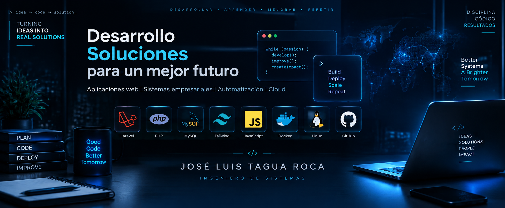

<!-- ==========================================================
     PROFESSIONAL GITHUB PROFILE
     José Luis Tagua Roca
     GitHub: @clos12x
=========================================================== -->


<div align="center">





<br><br>


<br><br>


</div>


<br>


# 👨‍💻 Perfil Profesional


Soy **Ingeniero de Sistemas** especializado en desarrollo de software, construcción de aplicaciones web y creación de soluciones digitales empresariales.


Mi enfoque está orientado al desarrollo de sistemas modernos, escalables y eficientes aplicando buenas prácticas de programación, arquitectura de software, diseño de bases de datos y automatización.


Me apasiona transformar ideas y necesidades reales en productos tecnológicos funcionales que generen valor.


---

# 🚀 Especialidades


<div align="center">


| Área | Descripción |
|---|---|
| 💻 Full Stack Development | Desarrollo de aplicaciones web completas |
| ⚙️ Backend Engineering | Arquitectura, lógica empresarial y APIs |
| 🗄️ Database Design | Modelado y optimización de datos |
| ☁️ DevOps & Cloud | Automatización, servidores e infraestructura |
| 🐧 Linux Administration | Gestión de entornos y servicios |


</div>


---

# ⚡ Stack Tecnológico


<div align="center">


</div>


## Backend

```yaml
Tecnologías:
  - PHP
  - Laravel Framework
  - REST APIs
  - MVC Architecture
  - Composer
```


## Frontend

```yaml
Tecnologías:
  - HTML5
  - CSS3
  - JavaScript
  - Blade
  - Tailwind CSS
  - React
```


## Database

```yaml
Tecnologías:
  - MySQL
  - SQLite
  - PostgreSQL
  - Database Modeling
  - Laravel Migrations
```


## DevOps

```yaml
Tecnologías:
  - Linux
  - Docker
  - Git
  - GitHub
  - Cloud Computing
  - CI/CD
```


---

# 🚀 Proyecto Principal


<div align="center">


# 🐾 Sistema Veterinaria


### Enterprise Veterinary Management & Pet Commerce Platform


</div>


Sistema web empresarial desarrollado con **Laravel**, diseñado para integrar la gestión completa de una clínica veterinaria junto con una plataforma comercial para productos de mascotas.


La solución integra administración, comercio electrónico, atención veterinaria y gestión avanzada de usuarios.


---

# 🏢 Administración del Sistema


## Panel Administrador


El administrador posee control completo:


✅ Gestión de usuarios.

✅ Creación de roles.

✅ Asignación de permisos.

✅ Administración de empleados.

✅ Gestión de veterinarios.

✅ Control general del sistema.


El administrador puede definir las funcionalidades disponibles para cada usuario según sus responsabilidades.


---

# 🛒 Comercio Electrónico


Módulo comercial para productos de mascotas:


Características:


✅ Catálogo de productos.

✅ Gestión de productos.

✅ Procesamiento de compras.

✅ Control de pedidos.

✅ Seguimiento de estados.

✅ Confirmaciones por correo electrónico.


Flujo:


```
Cliente

↓

Selecciona producto

↓

Realiza compra

↓

Empleado procesa pedido

↓

Pedido enviado

↓

Cliente recibe confirmación
```


---

# 🩺 Gestión Veterinaria


Módulo especializado para profesionales:


Funciones:


✅ Asignación de veterinarios.

✅ Notificación de nuevas consultas.

✅ Gestión de clientes asignados.

✅ Atención presencial.

✅ Atención virtual.

✅ Registro de servicios veterinarios.


---

# 👥 Sistema de Roles


## 👑 Administrador

Responsabilidades:

- Control total.
- Usuarios.
- Permisos.
- Configuración.
- Reportes.


## 🩺 Veterinario

Funciones:

- Consultas asignadas.
- Atención al cliente.
- Servicios médicos.


## 👨‍💼 Empleado

Funciones:

- Productos.
- Ventas.
- Pedidos.
- Gestión comercial.


## 🧑 Cliente

Funciones:

- Compras.
- Seguimiento.
- Solicitud de servicios.


---

# 📊 Reportes Empresariales


Sistema preparado para:


📈 Reportes administrativos.

📄 Control de información.

🧾 Gestión de procesos.

📊 Análisis operativo.


---

# 🏗️ Arquitectura


```
              CLIENTE

                 ↓

              VISTA

                 ↓

           CONTROLADOR

                 ↓

              MODELO

                 ↓

          BASE DE DATOS
```


Arquitectura basada en:

**MVC Pattern (Model - View - Controller)**


---

# 💼 Portafolio


<table>

<tr>

<td width="50%">


## 🐾 Sistema Veterinaria

Laravel • PHP • MySQL

Plataforma empresarial con ecommerce, roles, permisos y gestión veterinaria.


</td>


<td width="50%">


## 💊 Farmacia DevOps

C#

Sistema administrativo empresarial.


</td>

</tr>


<tr>


<td width="50%">


## 🏪 Mercado Privado

Laravel

Aplicación web comercial.


</td>


<td width="50%">


## 🌐 Web Applications

PHP • JavaScript

Desarrollo de soluciones digitales.


</td>


</tr>


</table>


---

# 📚 Actualmente aprendiendo


<div align="center">


</div>


- Arquitectura Cloud.
- Automatización DevOps.
- Seguridad informática.
- Infraestructura tecnológica.


---

# 📊 GitHub Analytics


<div align="center">


</div>


---

# 🐍 Contribution Activity


<div align="center">


</div>


---

# 📫 Contacto


<div align="center">


📍 Santa Cruz, Bolivia


<br>


<a href="https://github.com/clos12x">


</a>


<a href="mailto:joseluistagua22@gmail.com">


</a>


</div>


---

<div align="center">


### 🚀 Building software. Creating solutions. Improving technology.


</div>
