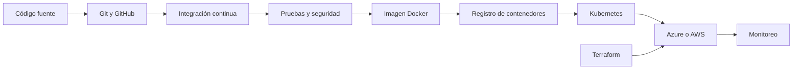

<!-- =========================================================
     PERFIL PROFESIONAL DE JOSÉ LUIS TAGUA ROCA
     GitHub: @clos12x
========================================================== -->

<div align="center">


<a href="https://github.com/clos12x">
  
</a>
<a href="https://www.linkedin.com/in/jose-luis-tagua-roca-3866a4332/">
  
</a>
<a href="mailto:joseluistaguaroca22@gmail.com">
  
</a>

<br><br>


</div>

---

## 👨‍💻 Perfil profesional

Soy **Ingeniero en Sistemas** enfocado en el desarrollo de aplicaciones web, sistemas administrativos y soluciones digitales orientadas a pequeñas empresas, emprendimientos y proyectos educativos.

Mi experiencia principal está centrada en **Laravel, PHP y JavaScript**. También cuento con conocimientos y experiencia práctica en **C#, .NET, Java, Python, Angular, React, Tailwind CSS y Bootstrap**.

Actualmente curso un **Diplomado en DevOps**, donde continúo fortaleciendo conocimientos en automatización, contenedores, integración continua, infraestructura como código, orquestación y servicios cloud.

```yaml
perfil:
  nombre: José Luis Tagua Roca
  profesión: Ingeniero en Sistemas
  enfoque:
    - Desarrollo web
    - Sistemas administrativos
    - Automatización
    - DevOps y Cloud

  experiencia_principal:
    - Laravel
    - PHP
    - JavaScript
    - Bases de datos SQL y NoSQL

  formación_actual:
    - Docker
    - Kubernetes
    - Terraform
    - Azure
    - AWS
    - CI/CD
```

---

## ⚡ Lo que construyo

<table>
<tr>
<td width="25%" align="center">
  <h3>🌐</h3>
  <strong>Aplicaciones web</strong>
  <br><br>
  Sistemas funcionales y adaptados a necesidades reales.
</td>
<td width="25%" align="center">
  <h3>⚙️</h3>
  <strong>Backend y APIs</strong>
  <br><br>
  Lógica de negocio, servicios y APIs REST.
</td>
<td width="25%" align="center">
  <h3>🗄️</h3>
  <strong>Gestión de datos</strong>
  <br><br>
  Bases de datos relacionales y no relacionales.
</td>
<td width="25%" align="center">
  <h3>☁️</h3>
  <strong>DevOps y Cloud</strong>
  <br><br>
  Contenedores, pipelines e infraestructura.
</td>
</tr>
</table>

---

## 🧩 Stack tecnológico

<div align="center">

### Lenguajes


### Frameworks y desarrollo web


### Bases de datos y servicios


<br>


### DevOps, Cloud y herramientas


<br>


</div>

---

## 🛠️ Competencias técnicas

| Área | Tecnologías y conocimientos |
|---|---|
| **Backend** | Laravel, PHP, C#, .NET, Java, Python y APIs REST |
| **Frontend** | JavaScript, Angular, React, HTML, CSS, Tailwind CSS y Bootstrap |
| **Bases de datos** | MySQL, PostgreSQL, MariaDB, SQLite, MongoDB y Firebase |
| **DevOps** | Docker, Kubernetes, Terraform, Azure DevOps y pipelines CI/CD |
| **Cloud** | Microsoft Azure y Amazon Web Services |
| **Herramientas** | Git, GitHub, Visual Studio, VS Code y MySQL Workbench |

---

# 🚀 Proyectos destacados

<div align="center">

<a href="https://github.com/clos12x/FarmaciaDevOps">
  
</a>

<a href="https://github.com/clos12x/mama-florita">
  
</a>

</div>

---

## 💊 FarmaciaDevOps

API REST para la gestión básica de medicamentos, utilizada también para aplicar prácticas iniciales de desarrollo backend y DevOps.

**Funciones implementadas**

- Consulta de medicamentos.
- Registro de medicamentos.
- Documentación de endpoints con Swagger.
- Creación de imagen mediante Docker.
- Integración continua con Azure Pipelines.
- Compilación automatizada del proyecto.

**Stack**


<a href="https://github.com/clos12x/FarmaciaDevOps">
  
</a>

---

## 🌸 Mamá Florita

Aplicación web progresiva para crear recordatorios personalizados con notificaciones y reproducción mediante voz en español.

**Funciones implementadas**

- Creación de recordatorios.
- Programación por fecha y hora.
- Repetición diaria.
- Notificaciones del navegador.
- Síntesis de voz en español.
- Persistencia mediante almacenamiento local.
- Instalación como aplicación PWA.

**Stack**


<a href="https://github.com/clos12x/mama-florita">
  
</a>

---

## 🔨 Próximos lanzamientos

<table>
<tr>
<td width="33%" valign="top">

### 🏪 Mercado Privado

Sistema web orientado a la gestión administrativa y operativa de un mercado privado.

**Estado:** preparación del repositorio y documentación.

</td>
<td width="33%" valign="top">

### 💇 Salón de Belleza

Plataforma para gestionar servicios, estilistas, clientes, citas, pagos y promociones.

**Estado:** desarrollo y organización.

</td>
<td width="33%" valign="top">

### ⚙️ PhoenixBuilderBackend

Backend trabajado con Docker, CI/CD, automatización, seguridad y despliegue cloud.

**Estado:** documentación técnica.

</td>
</tr>
</table>

> Los proyectos se incorporarán como destacados cuando tengan README, capturas, instrucciones de instalación y código organizado.

---

## ☁️ Mi ruta DevOps



### Formación actual

<div align="center">


<br>


</div>

---

## 📊 Actividad técnica

<div align="center">


</div>

> Este portafolio continuará creciendo con nuevos sistemas, prácticas DevOps y proyectos implementados.

---

## 🎯 Objetivo profesional

Mi objetivo es consolidar un perfil que conecte:

<div align="center">

### Desarrollo de software  
### Automatización de procesos  
### DevOps  
### Infraestructura Cloud

</div>

Busco aplicar estos conocimientos en soluciones funcionales, mejorar procesos de construcción y despliegue, y continuar creciendo mediante proyectos reales y aprendizaje constante.

---

## 📬 Contacto

<div align="center">

<a href="mailto:joseluistaguaroca22@gmail.com">
  
</a>

<a href="https://www.linkedin.com/in/jose-luis-tagua-roca-3866a4332/">
  
</a>

<a href="https://github.com/clos12x">
  
</a>

<br><br>

<strong>Desarrollo soluciones, automatizo procesos y convierto el aprendizaje en proyectos.</strong>


</div>

<!-- =========================================================
     SECCIÓN PREPARADA PARA PROYECTOS BTH
     Esta parte no aparecerá públicamente mientras siga
     dentro del comentario HTML.

## 🎓 Proyectos educativos BTH

Proyectos implementados para estudiantes de Bachillerato
Técnico Humanístico, desarrollados con apoyo de herramientas
de inteligencia artificial y revisión técnica.

### Proyecto 1
- Problema resuelto:
- Tecnologías:
- Participación realizada:
- Repositorio:
- Demostración:

========================================================== -->
